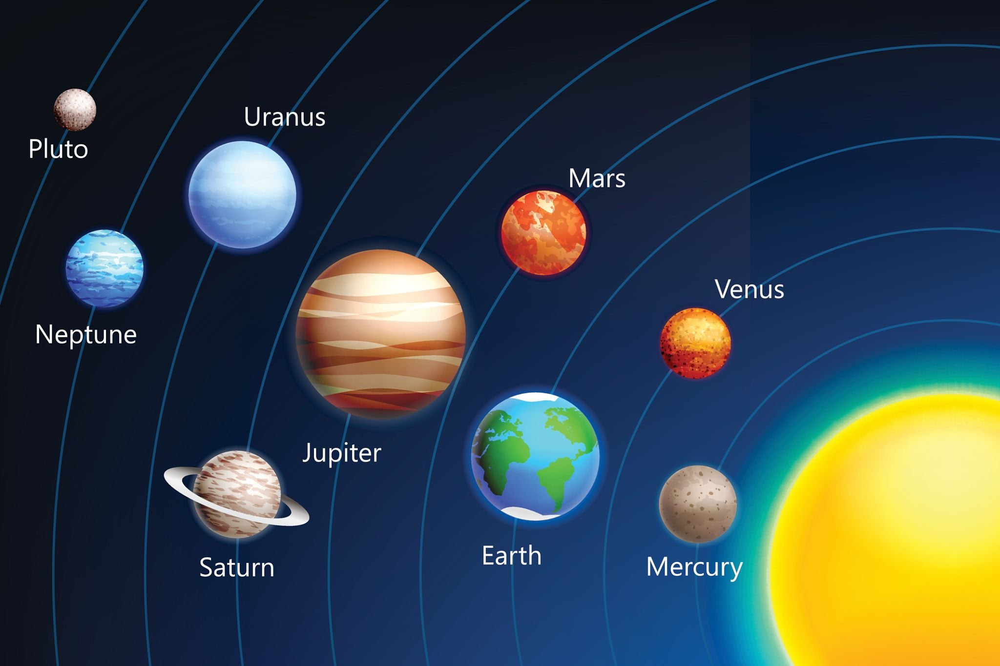

<html>
<head>
</head>
<body>
<h1>&nbsp;&nbsp;&nbsp;&nbsp;&nbsp;&nbsp;&nbsp;&nbsp;&nbsp;&nbsp;&nbsp;&nbsp;&nbsp;&nbsp;&nbsp;&nbsp;&nbsp;&nbsp;&nbsp;&nbsp;Galaxy</h1> 

<b>
برنامه تحقیق از سیارات کهکشان
</b>
ساده سازی شده برای درک دانش اموزان 

</body>
</html>